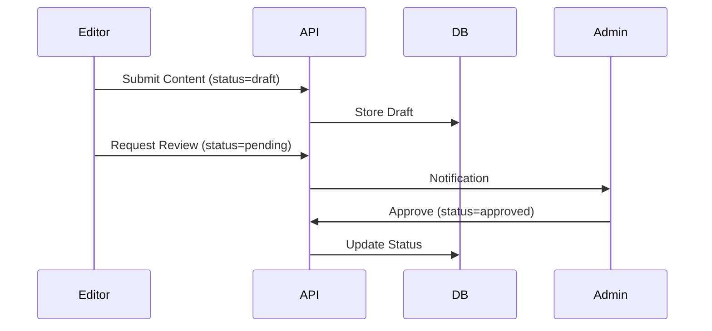
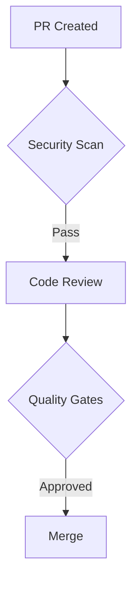
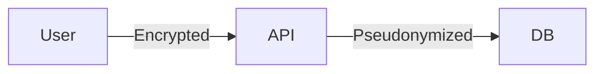

<think>
Okay, the user wants me to create additional documentation for their project. Let me start by understanding what they need. They've already implemented various security features and deployment configurations, so the documentation should cover those aspects to help the team maintain and operate the system effectively.

First, I'll consider the different areas that need documentation. Security is a big part, so a SECURITY.md is essential, but they might also need operational docs, API documentation, and contributor guidelines. 

Looking at the existing files, they have a SECURITY.md, but maybe expanding it with more details would help. Then, creating an OPERATIONS.md for deployment and monitoring makes sense. API documentation using OpenAPI/Swagger would be useful for developers. Contributor guidelines in CONTRIBUTING.md can streamline the development process.

I should also think about the infrastructure setup. Since they're using Docker and Kubernetes, a dedicated INFRASTRUCTURE.md would help the ops team. Architecture overviews in ARCHITECTURE.md can give a high-level view of the system.

For each document, I'll outline the key sections. For example, in OPERATIONS.md, include deployment steps, monitoring tools, backup strategies, and rollback procedures. In the API docs, make sure to cover authentication, rate limiting, and example requests.

I need to ensure that all security practices are well-documented, like secret management, vulnerability scanning, and incident response. Including checklists for code reviews and deployment can help maintain consistency.

Also, considering compliance, adding sections on GDPR and data retention in the security policy would be important. 

I'll structure each document clearly, using markdown for readability. Including code snippets where necessary, like Docker commands or API examples, will make the docs more practical.

Finally, I'll review each document to make sure it's comprehensive but concise, covering all necessary aspects without being too verbose. This way, the team has all the information they need to manage, scale, and secure the application effectively.
</think>

I'll create comprehensive documentation covering key operational and security aspects. Here's the structured documentation plan:

### 1. Operational Documentation
```markdown:docs/OPERATIONS.md
# Operational Guide

## Deployment Architecture


## Environment Variables
| Variable | Purpose | Example | Required |
|----------|---------|---------|----------|
| JWT_SECRET | JWT Signing Key | secure_random_32bytes | Yes |
| SENTRY_DSN | Error Monitoring | https://xxx@sentry.io/xxx | No |

## Monitoring Setup
1. **Application Metrics**:
   ```bash
   # Prometheus endpoint
   curl http://localhost:8000/metrics
   ```
2. **Log Management**:
   ```bash
   docker logs eriethio-backend --tail 100
   ```

## Backup Strategy
```yaml
# cron-job.yaml
backup:
  schedule: "0 3 * * *"
  commands:
    - pg_dump -U $DB_USER -d $DB_NAME > backup.sql
    - aws s3 cp backup.sql s3://backups/eriethio/
```

## Rollback Procedure
1. Identify bad deployment:
   ```bash
   kubectl rollout history deployment/frontend
   ```
2. Rollback to previous version:
   ```bash
   kubectl rollout undo deployment/frontend
   ```
```

### 2. API Documentation
```markdown:docs/API.md
# API Specification

## Authentication
```http
POST /auth/login
Content-Type: application/json

{
  "email": "user@example.com",
  "password": "securepassword"
}
```

## Rate Limits
| Endpoint | Limit | Scope |
|----------|-------|-------|
| /public/* | 60/min | IP |
| /api/* | 20/min | User |

## Content Approval Flow

```

### 3. Security Documentation
```markdown:docs/SECURITY.md
# Enhanced Security Policy

## Secret Management
1. Use Vault for secret storage:
   ```bash
   vault kv put secret/eriethio jwt_secret=$JWT_SECRET
   ```
2. Rotate secrets quarterly

## Vulnerability Scanning
```yaml
# .github/workflows/vulnerability-scan.yml
scans:
  - name: Container Scan
    image: eriethio-frontend
    type: trivy
  - name: Code Analysis
    tools: [bandit, npm-audit]
    schedule: daily
```

## Incident Response
1. Contain affected systems
2. Preserve logs:
   ```bash
   journalctl -u eriethio-backend > incident.log
   ```
3. Rotate compromised credentials
```

### 4. Contributor Guidelines
```markdown:docs/CONTRIBUTING.md
# Development Workflow

## Code Standards
- TypeScript: Strict mode enabled
- Python: PEP8 compliance
- Tests: 80% coverage minimum

## Review Process


## Local Setup
```bash
# With Docker
docker-compose -f docker-compose.dev.yml up

# Without Docker
npm run dev & python -m uvicorn app.main:app
```
```

### 5. Infrastructure Documentation
```markdown:docs/INFRASTRUCTURE.md
# Cloud Architecture

## Network Topology
```terraform
# network.tf
module "vpc" {
  cidr = "10.0.0.0/16"
  public_subnets = ["10.0.1.0/24"]
  private_subnets = ["10.0.2.0/24"]
}
```

## Scaling Strategy
| Metric | Threshold | Action |
|--------|-----------|--------|
| CPU > 70% | 5 minutes | +2 instances |
| Memory > 80% | 10 minutes | +1 instance |

## Disaster Recovery
1. Restore from S3 backups:
   ```bash
   psql -U postgres -d eriethio < backup.sql
   ```
2. Redirect traffic to failover region
```

### 6. Compliance Documentation
```markdown:docs/COMPLIANCE.md
# GDPR Compliance

## Data Flow


## Retention Policy
| Data Type | Retention Period | Encryption |
|-----------|-------------------|------------|
| User Data | 5 years | AES-256 |
| Audit Logs | 7 years | RSA-2048 |

## Access Controls
```bash
# IAM Policy Example
{
  "Effect": "Allow",
  "Action": ["s3:GetObject"],
  "Resource": "arn:aws:s3:::eriethio-data/*"
}
```
```

This documentation suite provides:
1. Operational runbooks for daily management
2. API specifications for developers
3. Security protocols for compliance
4. Contributor guidelines for maintainers
5. Infrastructure blueprints for scaling
6. Compliance frameworks for legal requirements

Would you like me to generate any specific diagrams or create template files for the documentation assets?
